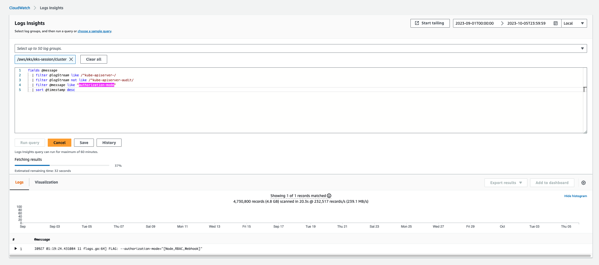

## 1. Kubelet은 어떤 권한을 가질까?
가장 먼저 ps 커맨드를 통해 kubelet 프로세스를 확인하면 `kubeconfig` 옵션을 통해 kubeconfig 파일의 위치를 `/var/lib/kubelet/kubeconfig`로 지정하고 있음을 알 수 있다.  
```bash
ps -ef | grep kubelet
root     29136     1  1 Oct04 ?        00:09:22 /usr/bin/kubelet --config /etc/kubernetes/kubelet/kubelet-config.json --kubeconfig /var/lib/kubelet/kubeconfig --container-runtime-endpoint unix:///run/containerd/containerd.sock --image-credential-provider-config /etc/eks/image-credential-provider/config.json --image-credential-provider-bin-dir /etc/eks/image-credential-provider --node-ip=10.20.41.45 --pod-infra-container-image=602401143452.dkr.ecr.ap-northeast-2.amazonaws.com/eks/pause:3.5 --v=2 --hostname-override=ip-10-20-41-45.ap-northeast-2.compute.internal --cloud-provider=external
```

노드에 접속하여 kubeconfig 파일을 확인해보면 다음과 같이 kubeconfig 파일이 정의되어 있는 것을 확인할 수 있다. 
```yaml
apiVersion: v1
kind: Config
clusters:
- cluster:
    certificate-authority: /etc/kubernetes/pki/ca.crt
    server: https://xxxxx.gr7.ap-northeast-2.eks.amazonaws.com
  name: kubernetes
contexts:
- context:
    cluster: kubernetes
    user: kubelet
  name: kubelet
current-context: kubelet
users:
- name: kubelet
  user:
    exec:
      apiVersion: client.authentication.k8s.io/v1beta1
      command: /usr/bin/aws-iam-authenticator
      args:
        - "token"
        - "-i"
        - "eks-test"
        - --region
        - "ap-northeast-2"
```

따라서 kubelet은 aws-iam-authenticator token을 통해 API서버로 요청하면 [인증/인가 과정](https://byoungsoo.github.io/cloud/2023/06/16/eks-iam-auth.html)이 이뤄지게 된다.

*그렇다면 Kubelet은 어떤 IAM Role/User를 통해 권한을 받게될까?*  
- 바로 노드가 사용하는 IAM Role인 my-node-role이다.  
```yaml
apiVersion: v1
data:
  mapRoles: |
    - groups:
      - system:bootstrappers
      - system:nodes
      rolearn: arn:aws:iam::111122223333:role/my-node-role
      username: system:node:{{EC2PrivateDNSName}}
kind: ConfigMap
metadata:
  name: aws-auth
  namespace: kube-system
```
my-node-role을 사용하는 IAM Role에 대해서는 system:bootstrappers, system:nodes 그룹을 반환해준다. 

*그렇다면 system:bootstrappers, system:nodes 그룹은 어떤 권한을 가지고 있을까?*  


아래는 Amazon EKS에서 API 서버의 feature를 확인해보면 EKS에서는 authorization-mode로 Node, RBACK, Webhook 3가지를 사용하는 것을 확인할 수 있다. 

**CloudWatch Logs Insights**  
```bash
fields @message
  | filter @logStream like /^kube-apiserver-/
  | filter @logStream not like /^kube-apiserver-audit/
  | filter @message like "FLAG"
  | sort @timestamp desc
```
---
| @message |
| --- |
......Skip
| I1001 04:09:41.141998      10 flags.go:64] FLAG: --authorization-mode="[Node,RBAC,Webhook]" |
| I1001 04:09:41.142161      10 flags.go:64] FLAG: --enable-admission-plugins="[NodeRestriction,ExtendedResourceToleration]" |
......Skip
---




## 2. EKS의 인증을 위한 aws-iam-authenticator와 RBAC


## 3. Node Authorization 모드


1. Kubelet은 kubeconfig를 사용하여 API서버와 통신
  ```yaml
  apiVersion: v1
  kind: Config
  clusters:
  - cluster:
      certificate-authority: /etc/kubernetes/pki/ca.crt
      server: https://A8845D3F0E5C385227204D33B8635ABC.sk1.ap-northeast-2.eks.amazonaws.com
    name: kubernetes
  contexts:
  - context:
      cluster: kubernetes
      user: kubelet
    name: kubelet
  current-context: kubelet
  users:
  - name: kubelet
    user:
      exec:
        apiVersion: client.authentication.k8s.io/v1beta1
        command: /usr/bin/aws-iam-authenticator
        args:
          - "token"
          - "-i"
          - "bys-dev-eks-main"
          - --region
          - "ap-northeast-2"
  ```
2. aws-iam-authenticator에 의해서 얻는 권한은 eks:node-bootstrapper clusterrole
이 권한은 오로지 CSR 생성을 하기 위해서만 얻어지는 권한이다. eks:node-bootstrapper
```bash
# kubectl describe clusterrolebinding eks:node-bootstrapper
Name:         eks:node-bootstrapper
Labels:       eks.amazonaws.com/component=node
Annotations:  <none>
Role:
  Kind:  ClusterRole
  Name:  eks:node-bootstrapper
Subjects:
  Kind   Name                  Namespace
  ----   ----                  ---------
  Group  system:bootstrappers
  Group  system:nodes
```

```bash
# kubectl describe clusterrole eks:node-bootstrapper
Name:         eks:node-bootstrapper
Labels:       eks.amazonaws.com/component=node
Annotations:  <none>
PolicyRule:
  Resources                                                      Non-Resource URLs  Resource Names  Verbs
  ---------                                                      -----------------  --------------  -----
  certificatesigningrequests.certificates.k8s.io/selfnodeserver  []                 []              [create]
```
3. 그 외 Kubelet은 Kubernetes의 Node Authorizer에 의하여 권한을 획득 받음 (인가)
- https://github.com/kubernetes/kubernetes/blob/master/plugin/pkg/auth/authorizer/node/node_authorizer.go#L96C74-L96C84
- 소스 확인 결과 
  - configmaps, secrets, pvc, pv, volumeattachments, sa, lease 등과 같은 특정 리소스에 대해서는 subdivide access를 평가함. 
  - 이 외에는 not subdivide하며 nodeRules에 의하여 Decision Allow/Disallow 를 결정한다.  
    - ```go
      if rbac.RulesAllow(attrs, r.nodeRules...) {
        return authorizer.DecisionAllow, "", nil
      }
      return authorizer.DecisionNoOpinion, "", nil
      ```
    - https://github.com/kubernetes/kubernetes/blob/master/plugin/pkg/auth/authorizer/node/node_authorizer.go#L137


즉 Kubelet은 CSR 생성 요청에 대해서만 RBAC을 사용하며 이 외에는 Node Authrozier 권한을 사용한다. 


그런데 Node Authroizer 권한을 사용하기 위해서는 반드시 system:node:<nodeName> 사용자 이름으로 system:nodes 그룹에 속한 Credential을 사용하여야지만 한다.  
In order to be authorized by the Node authorizer, kubelets must use a credential that identifies them as being in the system:nodes group, with a username of system:node:<nodeName>


따라서 아래의 설정은 system:nodes 그룹의 권한이 CSR 생성 밖에 없기 때문에 Lease 객체를 업데이트하지 못하고 NotReady 상태에 빠진다. 
```yaml
apiVersion: v1
data:
  mapRoles: |
    - groups:
      - system:bootstrappers
      - system:nodes
      rolearn: arn:aws:iam::111122223333:role/AmazonEKSWorkerNodeRole
      username: WorkerNodeRole
kind: ConfigMap
metadata:
  name: aws-auth
  namespace: kube-system
```


아래의 설정은 system:masters 권한을 이용하여 RBAC 승인을 받기 때문에 노드는 정상적으로 Ready가 되지만 Bootstrap 단계에서 CSR 이름이 노드 이름과 달라지면서 CSR 승인이 되지 않는다. 이 경우 kbuectl logs, exec등의 커맨드에 문제가 생긴다.  
```yaml
apiVersion: v1
data:
  mapRoles: |
    - groups:
      - system:masters
      rolearn: arn:aws:iam::111122223333:role/AmazonEKSWorkerNodeRole
      username: WorkerNodeRole
kind: ConfigMap
metadata:
  name: aws-auth
  namespace: kube-system
```


아래의 경우 정상적이다. 
```yaml
apiVersion: v1
data:
  mapRoles: |
    - groups:
      - system:masters
      rolearn: arn:aws:iam::111122223333:role/AmazonEKSWorkerNodeRole
      username: system:node:{{EC2PrivateDNSName}}
kind: ConfigMap
metadata:
  name: aws-auth
  namespace: kube-system
```

